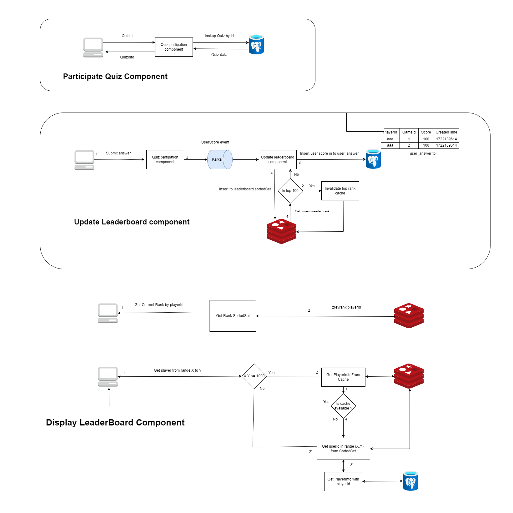
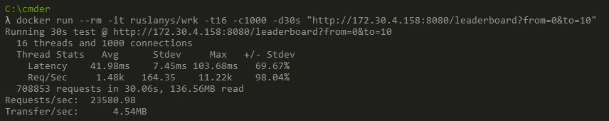
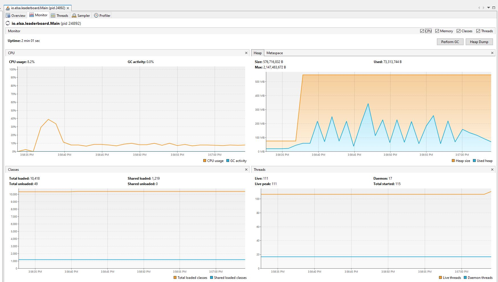
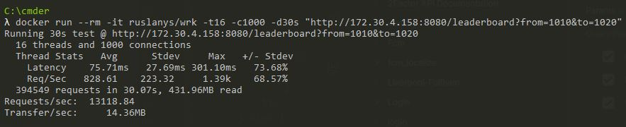
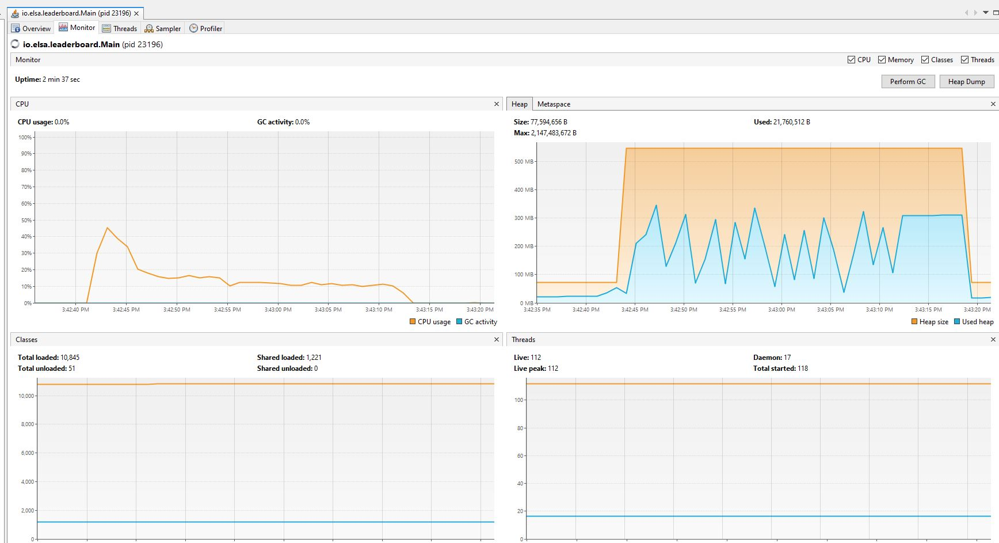
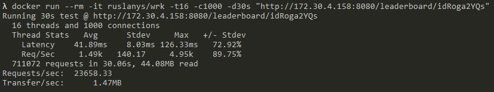
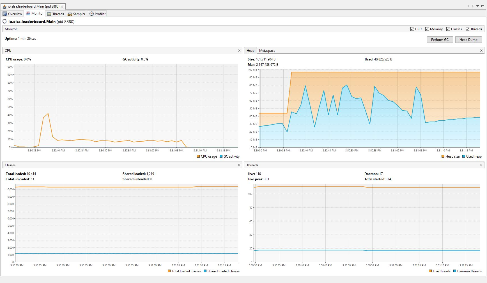
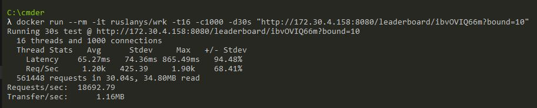
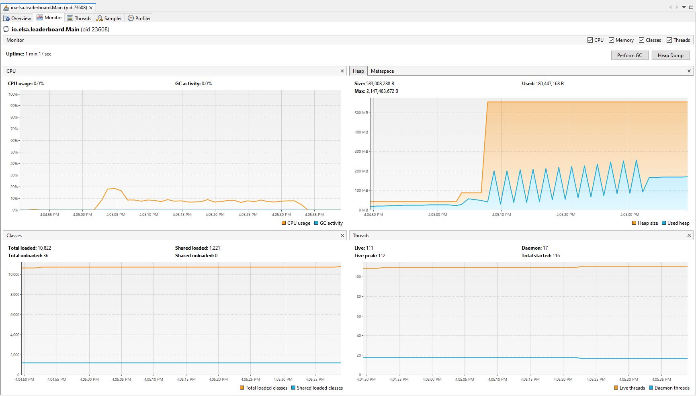

# Inquiry Leaderboard
### Prerequisites: JDK 17, Docker Desktop
## Bootstrap application:  
Step 1: At root folder, use  
`./gradlew shadowJar`

Step2: At root folder, use the following command:  
`cd docker`  
`docker-compose up`

## Create mock data 50M players:  
At root folder, use  
`java -jar InitData.jar {postgresHost} {redisHost}`  
`i.e java -jar InitData.jar 127.0.0.1 127.0.0.1`

## Design:
System design:

Dataflow:

Technologies:  
-  Service framework: Spring Boot, VertX
- Database: Postgres, Redis
- Infrastructure: Elastic Load Balancer, Amazon API gateway,Kafka
## Performance test result:
Tests were done with single instance Redis and VertX.  
Benchmark tools: Wrk  
Monitoring tool: JVisualvm  
JVM resource: 2x CPU core, 2GB ram, Windows OS   
Redis stub data: 50 millions element in LEADERBOARD sorted set.

Assume we got 50 million users view leaderboard daily.  
Minimum request/sec need to be achieved = 50.000.000/(24 * 60 * 60) = 579 req/sec.  
Assume at peak time, we got 10x traffic. The min req/sec need to be achieved = 579 * 10 = 5790 req/sec.  

### Endpoint
1.  Get top 10 player from leaderboard (with RedisCache):

2. Get random 10 players from leaderboard (No Cache):

3. Get rank with user id:  

4. Get relative rank with user id:

### *These tests were conducted on Windows machine that using default NIO, we will get better result in MacOS and Linux that using Kqueue and Epoll.*

